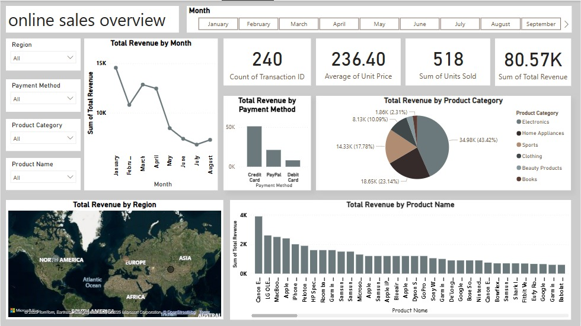

# Brainwave Matrix Intern – Task 1

## 📊 Online Sales Data Analysis Dashboard

This repository contains my submission for *Task 1* of the internship at *Brainwave Matrix Solutions*.

---

### 🔍 Project Overview
The task was to build a *sales data analysis dashboard* using real-world e-commerce data. I selected the *Online Sales Dataset* from Kaggle, which contains order data from a popular online marketplace.  

Using *Power BI*, I developed an interactive dashboard that provides insights into customer behavior, product performance, and payment trends.

---

### ✅ Dashboard Highlights:
- 🛒 Total Revenue and Orders Over Time
- 💰 Revenue Breakdown by Product and Product Category
- 📍 Sales by Region
- 💳 Payment Method Usage
- 📦 Most Frequently Ordered Products
- 🎯 Key Metrics: Average Order Value, Quantity Sold, Unique Customers

---

### 🛠 Tools & Skills Used:
- *Power BI* for interactive data visualization
- Power Query for data cleaning and transformation
- Data Modeling (DAX Calculations)
- Dashboard Design with slicers and filters for detailed analysis

---

### 📚 Dataset:
- *Source*: [Online Sales Dataset – Kaggle](https://www.kaggle.com/datasets/shreyanshverma27/online-sales-dataset-popular-marketplace-data)  
- Contains over 14,000+ orders with customer, product, price, and region data

---

### 📷 Sample Output:

---

### 🔗 LinkedIn Post:
[View my LinkedIn post](https://www.linkedin.com/posts/hagar-hassan-2a7539360_salesanalysis-dataanalytics-powerbi-activity-7319612286061465600-eH7T?utm_source=share&utm_medium=member_desktop&rcm=ACoAAFnHrV8BAbBbjvG1dqAG0P05fYERuH-Vbbo)

---

### 📁 Files Included:
- dashboard_screenshot.jpg – Preview of the final dashboard
- Online_Sales_Dashboard.pbix – Power BI file
- Online_Sales_Dataset.csv – Original dataset (optional or link to Kaggle)

---

### 🙌 About the Internship:
This dashboard was developed as part of a 2-task internship at *Brainwave Matrix Solutions*. It focuses on applying data analytics and business intelligence skills to real-world commercial data.